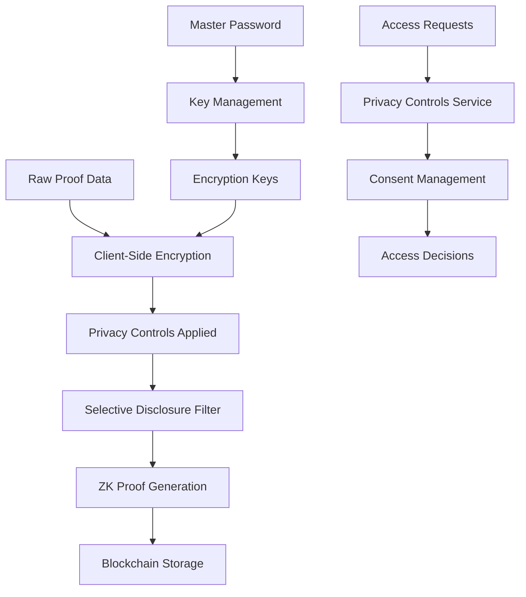
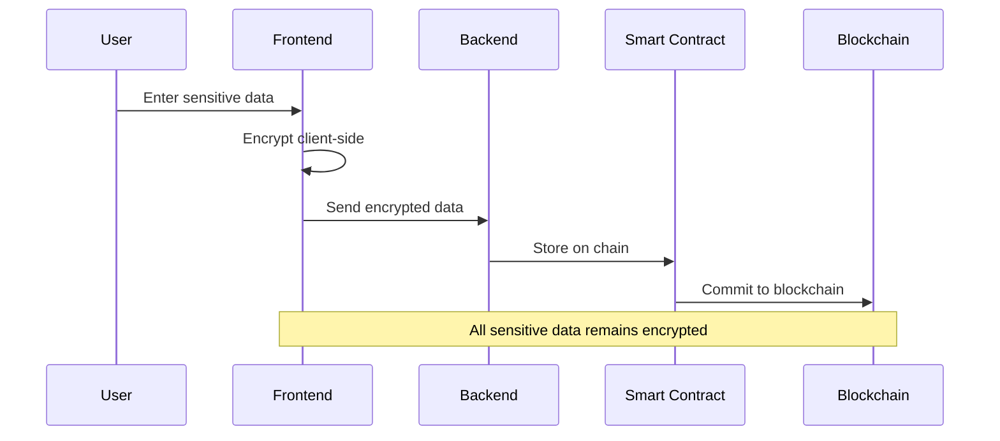

# Verinode Privacy and Encryption Features

## Overview

Verinode now includes comprehensive privacy and encryption capabilities to protect sensitive proof data while maintaining verifiability on the Stellar blockchain.

## Features Implemented

### 🔐 Client-Side Encryption
- **AES-256-GCM** encryption for symmetric encryption
- **RSA-4096** for asymmetric encryption
- **scrypt/PBKDF2** key derivation functions
- End-to-end encryption ensuring data privacy
- Secure key generation and management

### 🛡️ Privacy Controls
- **Granular visibility settings** (public/private/shared)
- **Access control lists** for specific viewers
- **Action-based permissions** (view/verify/share)
- **Time-based expiration** for access rights
- **Consent management** system
- **Data minimization** principles

### 🔍 Selective Disclosure
- **Field-level control** over data sharing
- **Disclosure templates** for common use cases
- **Purpose-based sharing** with recipient tracking
- **Privacy-preserving previews** before sharing
- **Audit trails** for disclosure activities

### 🔑 Key Management
- **Secure key storage** with master password protection
- **Automatic key rotation** with configurable intervals
- **Key compromise handling** with replacement generation
- **Encrypted key backup** and restoration capabilities
- **Role-based key access** controls

### 🤐 Zero-Knowledge Proofs
- **Age verification** without revealing actual age
- **Membership proofs** without identity disclosure
- **Range proofs** for numeric values
- **Hash preimage proofs** for commitments
- **Custom circuit creation** framework
- **Batch verification** capabilities

## Security Architecture

### Multi-Layer Protection



### Privacy Levels

1. **Public** - Anyone can view (basic metadata only)
2. **Shared** - Specific authorized viewers with custom permissions
3. **Private** - Only owner can access with full data minimization

### Data Flow Protection



## API Endpoints

### Security Routes

All security endpoints are available under `/api/security/`:

#### Encryption
- `POST /api/security/encrypt` - Encrypt data
- `POST /api/security/decrypt` - Decrypt data

#### Privacy Controls
- `POST /api/security/privacy-controls` - Set privacy settings
- `POST /api/security/consent/request` - Request access
- `POST /api/security/consent/grant` - Grant access permission

#### Selective Disclosure
- `POST /api/security/selective-disclosure` - Create selective disclosure
- `GET /api/security/disclosure/templates` - Get standard templates

#### Key Management
- `POST /api/security/key-management/initialize` - Initialize key system
- `POST /api/security/key-management/generate-keypair` - Generate key pairs
- `POST /api/security/key-management/rotate-key` - Rotate encryption keys

#### ZK Proofs
- `POST /api/security/zk-proof/generate` - Generate zero-knowledge proof
- `POST /api/security/zk-proof/verify` - Verify zero-knowledge proof
- `GET /api/security/zk-proof/circuits` - Get available ZK circuits

### Examples

#### 1. Encrypt Proof Data
```bash
curl -X POST http://localhost:3001/api/security/encrypt \
  -H "Content-Type: application/json" \
  -d '{
    "data": "{\"userId\":\"123\",\"salary\":50000,\"ssn\":\"123-45-6789\"}",
    "password": "strong-master-password-123"
  }'
```

#### 2. Set Privacy Controls
```bash
curl -X POST http://localhost:3001/api/security/privacy-controls \
  -H "Content-Type: application/json" \
  -d '{
    "proofId": "proof-123",
    "settings": {
      "visibility": "shared",
      "allowedViewers": ["GABC...1234", "GDEF...5678"],
      "allowedActions": ["view", "verify"],
      "requireConsent": true,
      "dataMinimization": true
    }
  }'
```

#### 3. Create Selective Disclosure
```bash
curl -X POST http://localhost:3001/api/security/selective-disclosure \
  -H "Content-Type: application/json" \
  -d '{
    "proofData": {"name": "John Doe", "age": 30, "salary": 50000},
    "disclosedFields": ["age"],
    "purpose": "Employment verification",
    "recipient": "HR Department"
  }'
```

#### 4. Generate ZK Proof
```bash
curl -X POST http://localhost:3001/api/security/zk-proof/generate \
  -H "Content-Type: application/json" \
  -d '{
    "circuitId": "age-verification",
    "privateInputs": {"actualAge": 30, "minimumAge": 18},
    "publicInputs": [18]
  }'
```

## Frontend Components

### EncryptionSettings
Provides UI for:
- Encryption algorithm selection
- Key derivation function choice
- Auto-rotation configuration
- Master password setup with strength meter

### PrivacyControls
Enables management of:
- Visibility settings (public/shared/private)
- Allowed actions per viewer
- Consent requirements
- Data minimization preferences
- Access request approval/rejection

### SelectiveDisclosure
Facilitates:
- Field-by-field disclosure selection
- Quick template application
- Purpose and recipient specification
- Disclosure preview before sharing
- Privacy impact visualization

## Smart Contract Integration

The privacy verification smart contract (`privacyVerification.rs`) provides:

### Core Functions
- `verify_privacy()` - Check access permissions
- `verify_selective_disclosure()` - Validate disclosed data
- `verify_zk_proof()` - Verify zero-knowledge proofs
- `check_consent()` - Validate consent permissions
- `set_privacy_settings()` - Update privacy configurations

### Storage Structure
- Privacy settings stored per proof
- Consent records with granter/grantee relationships
- Access logs for audit purposes
- Key rotation metadata

## Security Best Practices

### Key Management
1. **Use strong master passwords** (12+ characters, mixed case, numbers, symbols)
2. **Enable auto-rotation** with appropriate intervals
3. **Backup encryption keys** securely
4. **Monitor key usage** and access patterns

### Privacy Controls
1. **Apply principle of least privilege** - share minimum necessary data
2. **Use time-based expiration** for temporary access
3. **Require explicit consent** for sensitive data sharing
4. **Enable audit logging** for compliance purposes

### Data Handling
1. **Encrypt all sensitive data** client-side before transmission
2. **Use data minimization** by default
3. **Implement proper access controls** at multiple layers
4. **Regular security audits** of privacy settings

## Testing

### Unit Tests
```bash
# Run backend security tests
cd backend
npm test -- --testPathPattern=security

# Run smart contract tests
cd contracts
cargo test privacy
```

### Integration Tests
```bash
# Test end-to-end encryption flow
npm run test:e2e:encryption

# Test privacy controls workflow
npm run test:e2e:privacy
```

## Compliance

### GDPR Considerations
- **Data minimization** built into selective disclosure
- **Right to erasure** through key compromise handling
- **Consent management** for data processing
- **Privacy by design** in all components

### SOC 2 Compliance
- **Encryption at rest and in transit**
- **Access logging and monitoring**
- **Role-based access controls**
- **Regular security assessments**

## Future Enhancements

### Planned Features
- **Homomorphic encryption** for computations on encrypted data
- **Differential privacy** for statistical analysis
- **Multi-party computation** for collaborative verification
- **Advanced ZK proof systems** (Bulletproofs, Halo2)
- **Hardware security module** integration
- **Decentralized identity** integration

### Performance Optimizations
- **Batch encryption** operations
- **Caching layer** for frequently accessed data
- **Asynchronous key operations**
- **Compressed proof storage**

## Troubleshooting

### Common Issues

1. **Encryption failures**
   - Verify master password strength
   - Check key derivation parameters
   - Ensure sufficient entropy

2. **Privacy control errors**
   - Validate Stellar addresses
   - Check permission hierarchies
   - Verify consent expiration dates

3. **ZK proof verification failures**
   - Confirm circuit compatibility
   - Validate input formats
   - Check proof generation parameters

### Debugging Tools
- **Privacy dashboard** for monitoring access patterns
- **Encryption key status** viewer
- **ZK proof debugger** with step-by-step verification
- **Audit log analyzer** for compliance reporting

## Support

For issues or questions regarding privacy features:
- Check the [documentation](./docs)
- Review [security guidelines](./SECURITY.md)
- Contact the security team via [security@verinode.com](mailto:security@verinode.com)
- File issues in the [GitHub repository](https://github.com/jobbykingz/Verinode/issues)

---

*Last updated: February 2026*
*Version: 1.0.0*